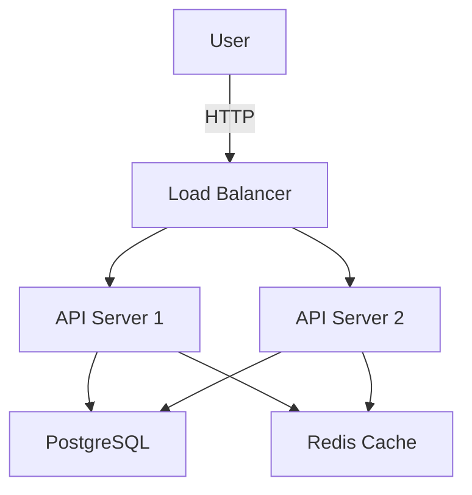

# Personal Documentation Style Preferences

**Purpose**: My preferred documentation approaches across all projects.

**Usage**: Reference when writing docs. Document project-specific docs in `.ai/knowledge/` via `/capture`.

---

## Documentation Philosophy

### Core Principles

1. **Documentation is for humans** - Write for the reader, not the writer
2. **Show, don't just tell** - Examples > long explanations
3. **Keep it current** - Outdated docs are worse than no docs
4. **Progressive disclosure** - Start simple, link to details
5. **Docs live with code** - Close to what they document

---

## README Files

### Every Project Needs

A README.md with:
1. **What** - One-sentence description
2. **Why** - Problem it solves
3. **How** - Quick start / installation
4. **Examples** - Basic usage
5. **Links** - Where to learn more

### README Template

```markdown
# Project Name

> One-sentence description of what this does

## What It Does

2-3 paragraphs explaining:
- The problem this solves
- Who it's for
- Key features

## Quick Start

```bash
# Installation
npm install project-name

# Basic usage
npm start
```

## Usage Examples

```typescript
// Common use case
import { Thing } from 'project-name';

const result = Thing.doSomething();
```

## Documentation

- [Getting Started](./docs/getting-started.md)
- [API Reference](./docs/api.md)
- [Contributing](./CONTRIBUTING.md)

## License

MIT
```

---

## Code Comments

### When to Comment

✅ **Comment when**:
- Explaining **why**, not what
- Non-obvious algorithms
- Workarounds for bugs
- Complex business rules
- Public API usage

❌ **Don't comment**:
- Obvious code (`i++; // increment i`)
- What code does (code shows that)
- Instead of refactoring unclear code
- To disable code (delete it, use git history)

### Comment Style

```typescript
// Good: Explains WHY
// Using exponential backoff to avoid overwhelming the API
// after we saw rate limiting issues in production
await retryWithBackoff(apiCall, 3, 1000);

// Bad: Explains WHAT (code already shows this)
// Retry the API call 3 times with 1000ms delay
await retryWithBackoff(apiCall, 3, 1000);

// Good: Documents non-obvious business rule
// Discount applies to order total BEFORE tax,
// per accounting department requirement (Ticket #1234)
const discount = calculateDiscount(subtotal);

// Good: Warning about gotcha
// IMPORTANT: This must run before transaction starts
// or you'll get deadlocks (see issue #456)
await acquireLock(resourceId);
```

---

## Function/Method Documentation

### Public APIs - Always Document

```typescript
/**
 * Calculates the discount for an order based on customer type and order total.
 *
 * Business rules:
 * - Regular customers: 10% discount on orders > $100
 * - VIP customers: 15% discount on orders > $50
 * - No discount on orders <= threshold
 *
 * @param orderTotal - Total order amount in dollars (before tax)
 * @param customerType - Type of customer ('regular' | 'vip')
 * @returns Discount amount in dollars (not percentage)
 * @throws {ValidationError} If orderTotal is negative or customerType is invalid
 *
 * @example
 * ```typescript
 * const discount = calculateDiscount(150, 'regular');
 * // Returns: 15 (10% of 150)
 *
 * const vipDiscount = calculateDiscount(75, 'vip');
 * // Returns: 11.25 (15% of 75)
 * ```
 */
export function calculateDiscount(
  orderTotal: number,
  customerType: 'regular' | 'vip'
): number {
  // Implementation...
}
```

### Private Functions - Document If Complex

```typescript
// Simple private function - no doc needed
function isValidEmail(email: string): boolean {
  return /^[^\s@]+@[^\s@]+\.[^\s@]+$/.test(email);
}

// Complex private function - document it
/**
 * Merges customer data from multiple sources with conflict resolution.
 *
 * Priority: Database > API > Cache
 * Null values are ignored (don't overwrite existing data)
 *
 * Used by: syncCustomerData()
 */
function mergeCustomerData(
  dbData: Partial<Customer>,
  apiData: Partial<Customer>,
  cacheData: Partial<Customer>
): Customer {
  // Implementation...
}
```

---

## API Documentation

### REST API

**Document for each endpoint**:

```markdown
### POST /api/users

Create a new user account.

**Request:**
```json
{
  "email": "user@example.com",
  "name": "John Doe",
  "role": "user" // Optional, defaults to "user"
}
```

**Response:** `201 Created`
```json
{
  "id": "usr_123",
  "email": "user@example.com",
  "name": "John Doe",
  "role": "user",
  "createdAt": "2025-11-08T10:00:00Z"
}
```

**Errors:**
- `400 Bad Request` - Invalid email format
- `409 Conflict` - Email already exists
- `500 Internal Server Error` - Server error

**Example:**
```bash
curl -X POST /api/users \
  -H "Content-Type: application/json" \
  -d '{"email":"user@example.com","name":"John Doe"}'
```
```

### GraphQL API

Use schema comments:

```graphql
"""
User account in the system.
Contains authentication and profile information.
"""
type User {
  """Unique identifier for the user"""
  id: ID!

  """Email address (used for login)"""
  email: String!

  """Display name"""
  name: String!

  """
  User role determining permissions.
  Defaults to 'user' on creation.
  """
  role: UserRole!
}

"""Available user roles"""
enum UserRole {
  """Regular user with basic permissions"""
  USER

  """Administrator with full access"""
  ADMIN
}
```

---

## Architecture Documentation

### ADRs (Architecture Decision Records)

**When to write**: For significant technical decisions

**Format**: `.ai/context/decisions/NNN-title.md`

```markdown
---
type: decision
title: Use PostgreSQL for Primary Database
status: accepted
date: 2025-11-08
---

# Use PostgreSQL for Primary Database

## Context

We need to select a database for storing user data, orders, and analytics.

Requirements:
- ACID transactions
- Complex queries (joins, aggregations)
- JSON support (flexible schema in some tables)
- Proven at scale

Options considered:
- PostgreSQL
- MySQL
- MongoDB

## Decision

We will use PostgreSQL 15+ as our primary database.

## Rationale

**Why PostgreSQL:**
- ✅ Strong ACID guarantees
- ✅ Excellent JSON support (JSONB)
- ✅ Powerful query optimizer
- ✅ Battle-tested at scale (Instagram, Spotify)
- ✅ Rich extension ecosystem
- ✅ Team has PostgreSQL experience

**Why not MySQL:**
- ❌ Weaker JSON support
- ❌ Less powerful query features

**Why not MongoDB:**
- ❌ Need strong consistency guarantees
- ❌ Complex relational data model
- ❌ ACID across multiple documents is awkward

## Consequences

**Positive:**
- Can use advanced SQL features (window functions, CTEs)
- JSONB allows schema flexibility where needed
- Single database for relational + document data

**Negative:**
- Need to run PostgreSQL in infrastructure
- Team members unfamiliar with Postgres need to learn

**Neutral:**
- Will use an ORM (TypeORM) to abstract some Postgres-specific features

## Follow-up

- Set up PostgreSQL in Docker for local development
- Configure connection pooling (pg-pool)
- Establish backup strategy
```

### System Architecture Diagrams

**Use ASCII art for simple diagrams:**

```
┌──────────┐     ┌──────────┐     ┌──────────┐
│  Client  │────▶│   API    │────▶│ Database │
└──────────┘     │  Server  │     └──────────┘
                 └─────┬────┘
                       │
                       ▼
                 ┌──────────┐
                 │  Cache   │
                 └──────────┘
```

**For complex diagrams**: Use Mermaid (renders on GitHub)



---

## Inline Documentation

### TypeScript/JavaScript

```typescript
/**
 * JSDoc for public functions
 */
export function publicAPI() {}

// Simple comment for private/internal
function internalHelper() {}
```

### Python

```python
def calculate_total(items: List[Item], tax_rate: float) -> float:
    """
    Calculate the total cost including tax.

    Args:
        items: List of items in the order
        tax_rate: Tax rate as decimal (0.08 for 8%)

    Returns:
        Total cost including tax

    Raises:
        ValueError: If tax_rate is negative

    Example:
        >>> items = [Item(price=10), Item(price=20)]
        >>> calculate_total(items, 0.08)
        32.4
    """
    if tax_rate < 0:
        raise ValueError("Tax rate cannot be negative")

    subtotal = sum(item.price for item in items)
    return subtotal * (1 + tax_rate)
```

---

## Changelog

### Keep a CHANGELOG.md

**Format**: Based on [Keep a Changelog](https://keepachangelog.com/)

```markdown
# Changelog

All notable changes to this project will be documented in this file.

The format is based on [Keep a Changelog](https://keepachangelog.com/en/1.0.0/),
and this project adheres to [Semantic Versioning](https://semver.org/spec/v2.0.0.html).

## [Unreleased]

### Added
- User authentication with JWT

### Changed
- Improved error messages for validation failures

### Fixed
- Race condition in order processing

## [1.2.0] - 2025-11-08

### Added
- REST API for user management
- PostgreSQL database integration
- Docker compose setup for local development

### Changed
- Updated dependencies to latest versions

### Deprecated
- `oldFunction()` will be removed in 2.0.0, use `newFunction()` instead

### Security
- Fixed SQL injection vulnerability in search endpoint
```

---

## Contributing Guidelines

### CONTRIBUTING.md Template

```markdown
# Contributing

Thanks for your interest in contributing!

## Development Setup

```bash
# Clone repo
git clone ...

# Install dependencies
npm install

# Run tests
npm test
```

## Making Changes

1. **Fork** the repository
2. **Create a branch**: `git checkout -b feature/your-feature`
3. **Make changes** with clear, focused commits
4. **Write tests** for new functionality
5. **Ensure tests pass**: `npm test`
6. **Submit a PR** with a clear description

## Code Style

We use Prettier for formatting. Run `npm run format` before committing.

See [Coding Standards](.ai/preferences/coding-standards.md) for our preferences.

## Commit Messages

Use [Conventional Commits](https://www.conventionalcommits.org/):

- `feat: add user authentication`
- `fix: resolve login timeout issue`
- `docs: update API documentation`
- `refactor: simplify error handling`
- `test: add tests for user service`

## Questions?

Open an issue or reach out to [maintainer contact].
```

---

## Documentation Organization

### Standard Structure

```
project/
├── README.md                  # Start here
├── CHANGELOG.md               # Version history
├── CONTRIBUTING.md            # How to contribute
│
├── docs/                      # Detailed documentation
│   ├── getting-started.md     # Installation, setup
│   ├── architecture.md        # System design
│   ├── api/                   # API reference
│   │   ├── users.md
│   │   └── orders.md
│   └── guides/                # How-to guides
│       ├── deployment.md
│       └── testing.md
│
└── .ai/                       # AI knowledge base
    ├── INDEX.md               # AI's entry point
    ├── context/               # Architecture, decisions
    └── knowledge/             # Features, patterns
```

---

## Examples Over Explanations

### Prefer This:

```markdown
## Creating a User

```typescript
import { createUser } from './user-service';

const user = await createUser({
  email: 'user@example.com',
  name: 'John Doe'
});

console.log(user.id); // usr_123
```
```

### Over This:

```markdown
## Creating a User

To create a user, you need to call the createUser function
which is exported from the user-service module. The function
takes an object with email and name properties and returns
a promise that resolves to a user object containing an id...
```

**Why**: Code example is self-explanatory and copy-pasteable.

---

## Documentation Anti-Patterns

### ❌ Outdated Documentation

```markdown
<!-- BAD: Doesn't match current code -->
## Installation

```bash
npm install old-package-name  # Package was renamed!
```
```

**Fix**: Keep docs next to code, update together

### ❌ Over-Documentation

```typescript
// BAD: Obvious comments everywhere
function calculateTotal(items) {
  // Initialize sum to 0
  let sum = 0;

  // Loop through each item
  for (const item of items) {
    // Add item price to sum
    sum += item.price;
  }

  // Return the sum
  return sum;
}

// GOOD: Self-documenting code
function calculateTotal(items) {
  return items.reduce((sum, item) => sum + item.price, 0);
}
```

### ❌ No Examples

```markdown
<!-- BAD: Just interface definition -->
## createUser(data)

Creates a user.

Parameters:
- data: UserData

Returns: User
```

```markdown
<!-- GOOD: Shows how to use it -->
## createUser(data)

Creates a new user account.

**Example:**
```typescript
const user = await createUser({
  email: 'test@example.com',
  name: 'Test User'
});
```

**Parameters:**
- `data.email` (string, required) - User's email address
- `data.name` (string, required) - User's display name

**Returns:** Promise<User>

**Throws:** ValidationError if email is invalid
```

---

## Documentation Maintenance

### Review Quarterly

- ❓ Is it still accurate?
- ❓ Do examples still work?
- ❓ Are there new features to document?
- ❓ Can outdated sections be removed?

### Keep Docs Close to Code

✅ **Good**:
```
src/
└── auth/
    ├── auth.service.ts
    ├── auth.service.test.ts
    └── README.md           # Auth subsystem docs
```

❌ **Bad**:
```
docs/
└── auth-service-documentation.md  # Far from code, gets outdated
```

---

## Project-Specific Documentation

Document in `.ai/knowledge/` via `/capture`:

- API endpoints and their usage
- Database schema and migrations
- Deployment procedures
- Environment variables
- Third-party integrations
- Known issues and workarounds

The knowledge base serves as living documentation that stays current with code.

---

Updated: 2025-11-08
